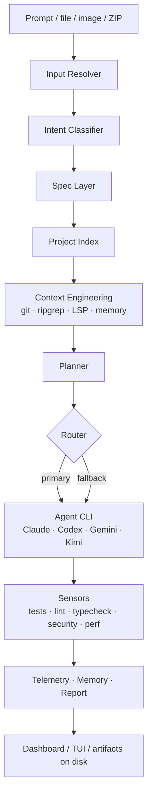
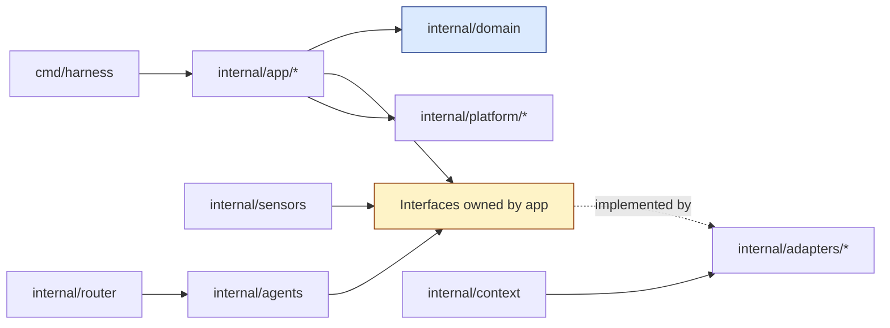

# HarnessX

Local-first adaptive runtime for agentic software engineering. Orchestrates
multiple coding CLIs (Claude Code, Codex, Gemini, Kimi, future) through a
pluggable adapter system, gates work with deterministic sensors, engineers
minimal context packs with LSP, persists evidence in SQLite, and surfaces
results via TUI + local React dashboard.

> **Status: feature-complete against spec §29 phases 0–10.** Every command
> from `docs/cli-reference.md` is implemented. See `HARNESSX-MASTER-PLAN.md`
> for the per-phase checklist and `CHANGELOG.md` for milestones.

## Install

One-line installer (macOS + Linux, amd64/arm64):

```bash
curl -fsSL https://raw.githubusercontent.com/ropeixoto/harnessx/main/scripts/install.sh | bash
```

From source (Go 1.23+):

```bash
git clone https://github.com/ropeixoto/harnessx
cd harnessx
make build
./bin/harness version
```

Shell completion:

```bash
source <(harness completion bash)
harness completion zsh > "${fpath[1]}/_harness"
```

Localisation: `HARNESS_LANG=pt harness doctor` (community translations
live in `internal/platform/i18n/locales/`; PRs welcome).

## Quickstart

```bash
cd your-project
harness init                 # .harness/ with SQLite + config
harness doctor               # probe toolchain + agent CLIs
harness project index        # detect stacks → 8 project maps
harness agent list           # bundled adapters + project overrides
harness check                # run every applicable sensor
harness "create product search with filters"   # natural prompt → classified workflow
harness dashboard            # 127.0.0.1:7373 — read-only REST + React UI
```

## Capabilities by phase

| phase | commands |
|---|---|
| 1 | `init`, `doctor`, `logs [--follow]`, `version` |
| 2 | `project index [--force]`, `project inspect [<map>]` |
| 3 | `agent list`, `agent add <id>`, `agent discover <bin>`, `agent certify <id>` |
| 4 | `sensor list`, `sensor run <id>`, `check`, `ci` |
| 5 | `context build <task> [--force]`, `context inspect [<hash>]` |
| 6 | `ask`, `plan`, `run`, `feature`, `bugfix`, `report` + natural `harness "<prompt>"` |
| 7 | `design-to-product [<prompt>] [--source <zip\|folder>]` |
| 8 | `dashboard [--addr] [--open]`, `logs --follow` TUI |
| 9 | `optimize`, `perf-snapshot`, `perf-compare`, `image-audit`, `dependency-audit`, `log-audit`, `security-audit` |
| post | `memory list`, `memory promote` |

## Daily loop

```bash
# Spec → plan → (optional) execute → sensors → report
harness feature "add product search with filters" --yes --execute --budget 1.0

# Inspect what happened
harness report
harness sensor list
harness context inspect

# Resource hygiene
harness perf-snapshot --label baseline --report
# … apply changes …
harness perf-snapshot --label after
harness perf-compare
```

## Development

```bash
make install-hooks   # one-time: wires pre-commit / commit-msg / pre-push gates
make check           # vet + race tests + build
make e2e             # scripts/e2e-phase1.sh
make e2e-all         # every scripts/e2e-phase*.sh in order
make ci              # full local CI gate (the pre-push hook runs this)
make cd              # dashboard build + ci + release tarballs in dist/
make release         # multi-arch cross-build (darwin/linux × amd64/arm64)
make lint            # golangci-lint when installed
```

**Local-only CI/CD** — HarnessX deliberately does not use GitHub Actions
(or any hosted runner). Every push runs through the local `pre-push`
hook which executes `make ci`. Releases are produced by `make cd` on
the maintainer's machine and uploaded to the chosen distribution target
(GitHub Releases UI, S3, internal mirror).

Dashboard:

```bash
make dashboard-install
make dashboard-dev      # Vite dev server on :5173
make dashboard-build    # production build into web/dashboard/dist
make dashboard-test     # Vitest
harness dashboard       # Go binary serves dist (or built-in HTML if dist missing)
```

## Architecture

### How HarnessX works in 30 seconds



### Clean Architecture dependency direction



`domain` imports nothing. `app` depends on `domain` + ports it owns.
`adapters` implement those ports. Tests substitute fakes at the seam.

### Package map

```
cmd/harness         CLI entrypoint (Cobra)
internal/app        use cases (init, doctor, indexcmd, agentcmd, sensorcmd, contextcmd,
                    workflow, designcmd, dashboardcmd, optimizecmd, memorycmd, …)
internal/domain     pure types (Session, Run, Sensor, Agent, Memory, Artifact)
internal/adapters   sqlite, logger (JSONL), execprobe, http (dashboard), lsp (gopls)
internal/platform   config, paths, ids (ULID), hashing, clock, tokens, budget
internal/sensors    universal scanners + per-stack rule packs + runner
internal/agents     adapter contract + YAML loader + fake + registry + certify
internal/router     deterministic agent selection + fallback executor
internal/context    Pack builder + git/ripgrep/lsp/testmap/memory providers
internal/index      stack detection + 8 project maps + incremental cache
internal/intent     rule-based mode classifier
internal/spec       §8 markdown spec renderer
internal/plan       §9 plan renderer
internal/memory     evidence-gated promotion
internal/design     ZIP/folder ingest + manifest + feature map + roadmap
internal/optimize   snapshot/compare/image/deps/logs/report
internal/ui         Lip Gloss views + Bubble Tea TUI
web/dashboard       React + Vite + TS SPA (9 routes)
docs/               spec-driven documentation
.harness/           per-project runtime (sqlite, jsonl logs, caches, artifacts, product maps)
```

Dependency rule: `domain` imports nothing; `app` imports `domain` + interfaces;
`adapters` implement those interfaces. Tests substitute fakes at the seam.

## Documentation

| doc | covers |
|---|---|
| `docs/overview.md` | what HarnessX is + isn't |
| `docs/architecture.md` | layered architecture + roadmap |
| `docs/install.md` | system requirements |
| `docs/quickstart.md` | first session in under a minute |
| `docs/cli-reference.md` | every command |
| `docs/configuration.md` | YAML schema |
| `docs/agents.md` | adapter contract + bundled YAMLs + certification |
| `docs/sensors.md` | universal sensors + rule packs |
| `docs/skills.md` | versioned playbooks |
| `docs/context-engineering.md` | provider chain + cache |
| `docs/design-to-product.md` | Claude Design ZIP workflow |
| `docs/resource-optimization.md` | cycles A→G |
| `docs/security.md` | block-list + memory policy |
| `docs/dashboard.md` | REST API + React routes |
| `docs/contributing.md` | local loop |
| `HARNESSX-MASTER-PLAN.md` | per-phase checklist (single source of truth) |
| `CHANGELOG.md` | milestones |
| `CONTRIBUTING.md` | GitFlow, code rules, PR/review process |
| `CODE_OF_CONDUCT.md` | Contributor Covenant v2.1 |
| `SECURITY.md` | private vulnerability reporting |
| `CLAUDE.md` | sticky rules for every Claude/LLM session |

## Community

- Bugs / features / questions → GitHub Issues (templates auto-load and
  the community votes via 👍 reactions).
- Open-ended ideas → GitHub Discussions.
- Security → see `SECURITY.md`.

## Contributing

We use [GitFlow](https://nvie.com/posts/a-successful-git-branching-model/)
and Conventional Commits. Read `CONTRIBUTING.md` before opening a PR.

```bash
git checkout -b feature/<short-name> develop
# … work …
make check && make e2e-all
gh pr create --base develop
```

## License

MIT — see `LICENSE`.
